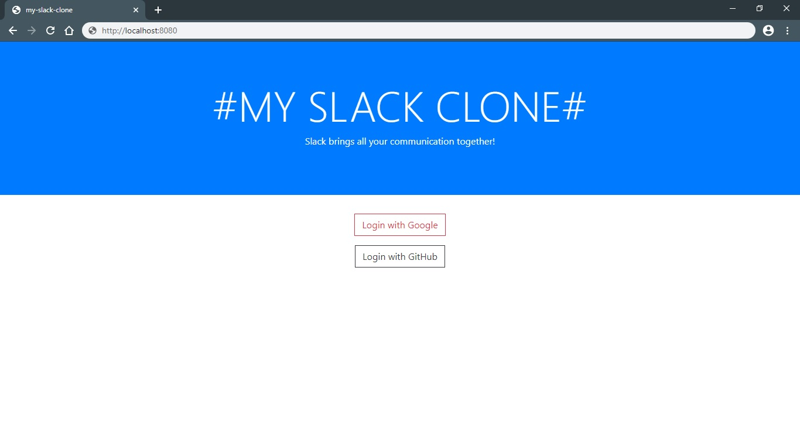
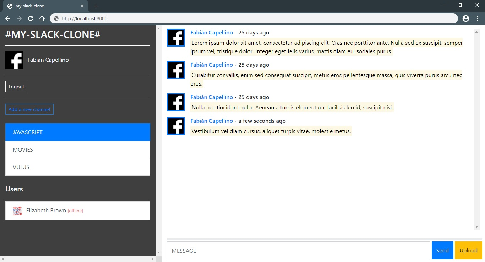

# Slack Clone with Vue.js and Firebase

A realtime messaging application built with Vue.js, VueX and Firebase.

## Technologies
- Bootstrap 4
- Firebase
- JavaScript
- Vue.js
- Vuex

## Screenshots

## Resources

- *[Documentation | Firebase](https://firebase.google.com/docs)*
- *[Documentation | Vue.js](https://vuejs.org/v2/guide/)*
- *[Vue Vuex Firebase Messaging App](https://www.udemy.com/course/vue-vuex-firebase/)*
